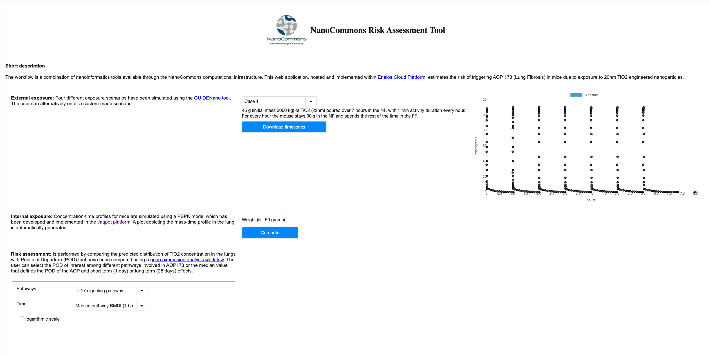

## Novamechanics

Novamechanics Ltd is an R&D performing SME dedicated in the development of predictive models and simulation tools for chemoinformatics, bioinformatics, nanoinformatics, modelling, simulation and medicinal & materials chemistry problems. 

http://enaloscloud.novamechanics.com/nanocommons/exposure/

#### Is an example application developed that integrates with Jaqpot to create predictions

#### Integration through Knime nodes

## Novamechanics at NanoSolveit

A platform for exposure simulations running at NanoSolveit.

#### NanoFase application integrates with Jaqpot to create predictions for the bioptake of Engineered nanomaterials