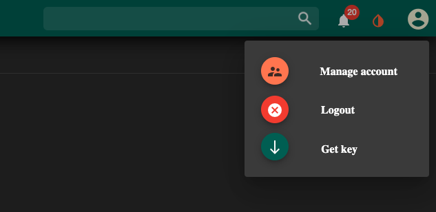

<!-- This is a link to [another document.](doc3.md) This is a link to an [external page.](http://www.example.com/) -->

## Welcome to jaqpotpy documentation

### About

jaqpotpy is a library that lets you deploy and share seemingless easy machine learning and statistal models developed with [sklearn](https://scikit-learn.org/stable/) over the web.


It is created by the [Unit of Process Control and Informatics in the School of Chemical Engineering](https://www.chemeng.ntua.gr/labs/control_lab/) at the National Technical University of Athens and supported by [Euclia](https://www.euclia.xyz).

### Contact

contact@euclia.xyz

## Install

### Install jaqpotpy

Jaqpotpy can be installed as a pypi package.

`pip install jaqpotpy` 


## Usage and initialization

### Import Jaqpot

`from jaqpotpy import Jaqpot`


### Initialize jaqpot


Jaqpot API and services are available at the base path **https://api.jaqpot.org/jaqpot/services/** 

Swagger and OpenAPI definition of the API can be found at **https://api.jaqpot.org/jaqpot/swagger/** 

`jaqpot = Jaqpot()`  initializes jaqpot upon the standard available API that 
is integrated with the application and user interface at **https://app.jaqpot.org/** .

Alternative installations can be used. If so jaqpotpy and jaqpot should be initialized to the base url of the installation 
 **etc:** `jaqpot = Jaqpot("https://api.jaqpot.org/jaqpot/services/")`

 ### Let jaqpot know who you are

Login and have access on the jaqpot services

In order to do so you can use the functions:

* `jaqpot.login('username', 'password')`

Will login and set the api key that is needed.

* `jaqpot.request_key('username', 'password')`

Same as above you request the key and set it on jaqpot

* `jaqpot.request_key_safe()`

Will ask the user for the username and password by hidding the password if 
jaqpot is used through a jupiter notebook etc

### Set Key without login

Some users may have logged in through google or github. At the account page 
a user can find an api key that can be used in order to have access on the services.
These keys have short life and should be updated on each login.

* `jaqpot.set_api_key("api_key")`

#### Get the key from user interface



The API key can be retrieved from the user interface. It will download a text file that contains the API key.

<!--  -->


## Deploy your models

Once initialized the models can then be deployed!


Bellow you can download a sample dataset that contains the **name of the country (ountry)** ,  **Gross domestic product (GDP)**, **labor force growth (LFG)**, 
**equipment investment (EQP)**, **nonequipment investment (NEQ)** and **relative GDP gap (GAP)**


Task:

Model the GDP. Pay attention to the diagnostics and suitability of your final model.


<a target="_blank" href="/docs/assets/gdp-countries.csv" download="gdp.csv">Download sample dataset</a>

### Model training and deployment


An example code that demonstrates a model deployemnt.


:::caution

Warning! One of the things that may differ from simpler training and validation routes is that you need to train your model with a pandas dataframe as input and not with Numpy arrays!

:::

```python
from jaqpotpy import Jaqpot
import pandas as pd
from sklearn.linear_model import LinearRegression


df = pd.read_csv('/path/to/gdp.csv')
lm = LinearRegression()

y = df['GDP']
X = df[['LFG', 'EQP', 'NEQ', 'GAP']]

model = lm.fit(X=X, y=y)

jaqpot.deploy_sklearn(model, X, y, title="Title", description="Describe")
```

The function will inform you about the model id that is created and is available through the user interface and the API.


:::info Result


- INFO - Model with id: <model_id> created. Visit the application to proceed

:::


### Model training and deployment with Domain of applicability


Domain of applicability contains knowledge or information on which the training set of the model has been developed, and for which it is applicable to make predictions for new instances.


<a target="_blank" href="https://en.wikipedia.org/wiki/Applicability_domain">About applicability domain</a>


```python
from jaqpotpy import Jaqpot
import pandas as pd
from sklearn.linear_model import LinearRegression


df = pd.read_csv('/path/to/gdp.csv')
lm = LinearRegression()

y = df['GDP']
X = df[['LFG', 'EQP', 'NEQ', 'GAP']]

model = lm.fit(X=X, y=y)

jaqpot.deploy_sklearn(model, X, y, title="Title", description="Describe", doa=X)

```


:::info Result


- INFO - Model with id: <model_id> created. Storing Domain of applicability
- INFO - Stored Domain of applicability. Visit the application to proceed

:::


### Train and deploy a pipeline!

Most models contain some preprocessing of the data and that is needed upon the prediction. In order to have a model that preprocess the data the model developer need to train and deploy a pipeline! 

It can be used as a standard scaler or a text tokenization or whatever the sklearn library offers.


```python
from jaqpotpy import Jaqpot
import pandas as pd
from sklearn.linear_model import LinearRegression
from sklearn.pipeline import Pipeline
from sklearn.preprocessing import StandardScaler


df = pd.read_csv('/path/to/gdp.csv')
lm = LinearRegression()

y = df['GDP']
X = df[['LFG', 'EQP', 'NEQ', 'GAP']]

pipe = Pipeline([('scaler', StandardScaler()), ('linear', LinearRegression())])

pipeline = pipe.fit(X=X, y=y)

pipeline.predict(X)

jaqpot.deploy_sklearn(pipeline, X, y, title="Pipeline", description="A pipeline deployment")

```


:::info Result

- INFO - Model with id: <model_id> created. Visit the application to proceed

:::


### Train and deploy a model with train meta data

If you wish to upload meta data add the desired True flag as input to the function.


````
from jaqpotpy import Jaqpot
import pandas as pd
from sklearn.linear_model import LinearRegression
from sklearn.pipeline import Pipeline
from sklearn.preprocessing import StandardScaler


df = pd.read_csv('/path/to/gdp.csv')
lm = LinearRegression()

y = df['GDP']
X = df[['LFG', 'EQP', 'NEQ', 'GAP']]

pipe = Pipeline([('scaler', StandardScaler()), ('linear', LinearRegression())])

pipeline = pipe.fit(X=X, y=y)

pipeline.predict(X)

jaqpot.deploy_sklearn(pipeline, X, y, title="Pipeline", description="A pipeline deployment", model_meta=True)

````


:::info Result

- INFO - Model with id: <model_id> created. Visit the application to proceed

:::


## Example


````
from jaqpotpy import Jaqpot
import pandas as pd
from sklearn.linear_model import LinearRegression

jaqpot = Jaqpot()
jaqpot.request_key_safe()

df = pd.read_csv('/path/to/gdp.csv')
lm = LinearRegression()

y = df['GDP']
X = df[['LFG', 'EQP', 'NEQ', 'GAP']]

model = lm.fit(X=X, y=y)

jaqpot.deploy_sklearn(model, X, y, title="Title", description="Describe", doa=X)

````


:::info Result


- INFO - Model with id: <model_id> created. Storing Domain of applicability
- INFO - Stored Domain of applicability. Visit the application to proceed

:::

**Your model is then available at https://app.jaqpot.org**